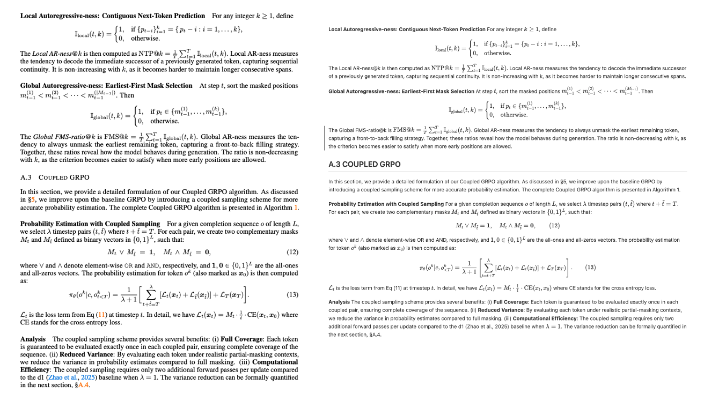
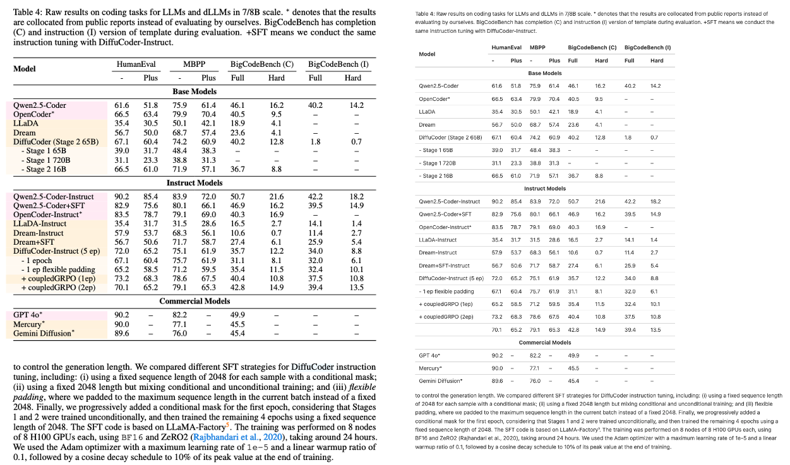
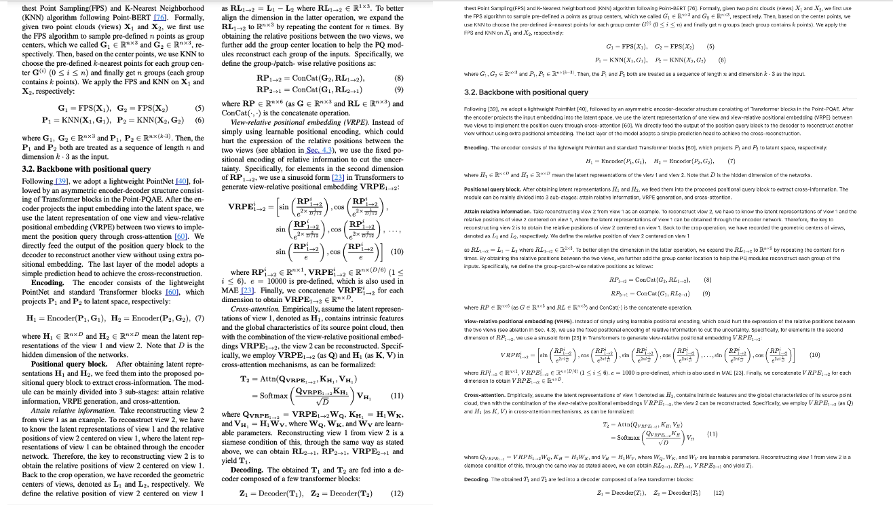
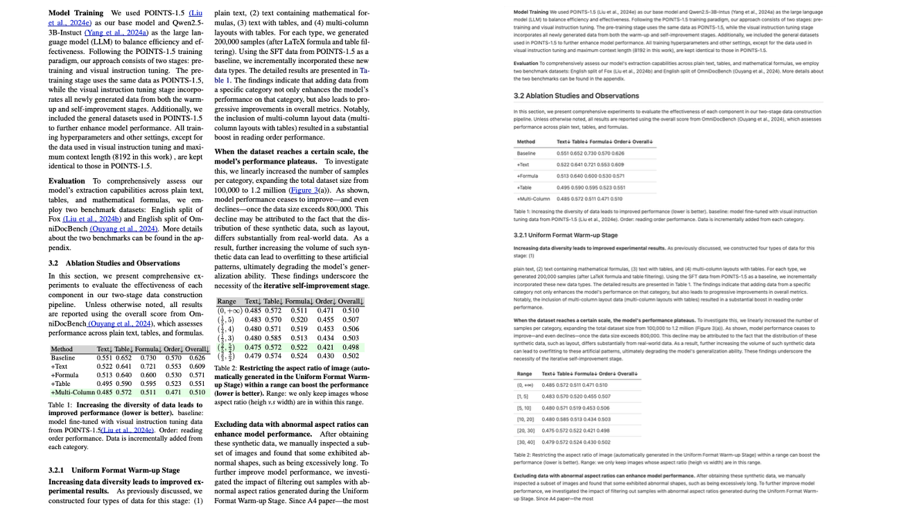

<p align="center">
    
<p>

<h1 align="center">
POINTS-Reader: Distillation-Free Adaptation of Vision-Language Models for Document Conversion
</h1>

<p align="center">
  <a href="https://huggingface.co/tencent/POINTS-Reader">
    
  </a>
  <a href="https://huggingface.co/spaces/prithivMLmods/POINTS-Reader-OCR">
    
  </a>
  <a href="https://huggingface.co/papers/2509.01215">
    
  </a>
  <a href="https://komarev.com/ghpvc/?username=tencent&repo=POINTS-Reader&color=brightgreen&label=Views" alt="view">
    
  </a>
</p>

We are delighted to announce that the WePOINTS family has welcomed a new member: POINTS-Reader, a vision-language model for end-to-end document conversion.

## News

- 2025.09.12: Quick Start with Transformers🤗: [Colab Notebook](https://github.com/PRITHIVSAKTHIUR/Multimodal-Outpost-Notebooks/blob/main/tencent-POINTS-Reader/tencent_POINTS_Reader.ipynb)
- 2025.09.11: A live [demo](https://huggingface.co/spaces/prithivMLmods/POINTS-Reader-OCR) of POINTS-Reader is now available on Hugging Face Spaces, thanks to a wonderful contribution from @prithivsakthiur.
- 2025.08.27: Support deploying POINTS-Reader with SGLang💪💪💪.
- 2025.08.26: We released the weights of the most recent version of POINT-Reader🔥🔥🔥.
- 2025.08.21: POINTS-Reader is accepted by **EMNLP 2025** for presentation at the **Main Conference**🎉🎉🎉.

## TODO

- Support inference demo.

## Introduction

1. **Simplicity**: POINTS-Reader is a very streamlined model that fully follows the structure of POINTS1.5, except that we have replaced Qwen2.5-7B-Instruct with Qwen2.5-3B-Instruct. Moreover, the input and output of POINTS-Reader are extremely straightforward. The input consists of a fixed prompt and a document image, and the output contains only a string (text extracted from the document image). The model's output is the final result delivered to the user without any post-processing.

2. **Performance**: Currently, POINTS-Reader supports extraction from both Chinese and English documents, achieving impressive results, with scores of 0.133 for English and 0.212 for Chinese on OmniDocBench.

3. **High Throughput**: With current mainstream inference frameworks, such as SGLang and vLLM, optimization is predominantly focused on LLMs. Thus, a large ViT would significantly impact the model’s throughput, which is why we selected a ViT with a moderate number of parameters (600M NaViT used in POINTS1.5). Combined with our support for SGLang, we currently achieve a very satisfactory throughput. We will also provide support for vLLM in the future.

4. **Open-source Technical Approach**: In the POINTS-Reader paper, we propose a two-stage data augmentation strategy. The first stage leverages automated data to endow the model with basic document extraction capabilities. In the subsequent stage, continuous self-evolution improves the quality of data generated by the model. The self-evolution approach in the second stage is highly extensible and can be applied to virtually any model.

## Results

For comparison, we use the results reported by [OmniDocBench](https://github.com/opendatalab/OmniDocBench/tree/main) and POINTS-Reader. Compared with the version submitted to EMNLP 2025, the current release provides (1) improved performance and (2) support for Chinese documents. Both enhancements build upon the methods proposed in this paper.

<table style="width: 92%; margin: auto; border-collapse: collapse;">
<thead>
<tr>
<th rowspan="2">Method Type</th>
<th rowspan="2">Methods</th>
<th colspan="2">Overall<sup>Edit</sup>↓</th>
<th colspan="2">Text<sup>Edit</sup>↓</th>
<th colspan="2">Formula<sup>Edit</sup>↓</th>
<th colspan="2">Formula<sup>CDM</sup>↑</th>
<th colspan="2">Table<sup>TEDS</sup>↑</th>
<th colspan="2">Table<sup>Edit</sup>↓</th>
<th colspan="2">Read Order<sup>Edit</sup>↓</th>
</tr>
<tr>
<th>EN</th>
<th>ZH</th>
<th>EN</th>
<th>ZH</th>
<th>EN</th>
<th>ZH</th>
<th>EN</th>
<th>ZH</th>
<th>EN</th>
<th>ZH</th>
<th>EN</th>
<th>ZH</th>
<th>EN</th>
<th>ZH</th>
</tr>
</thead>
<tbody>
<tr>
<td rowspan="9">Pipeline Tools</td>
<td>MinerU-pipeline-2.1.1</td>
<td>0.162</td>
<td>0.244</td>
<td>0.072</td>
<td>0.111</td>
<td>0.313</td>
<td>0.581</td>
<td>79.2</td>
<td>48.8</td>
<td>77.4</td>
<td>79.5</td>
<td>0.166</td>
<td>0.15</td>
<td>0.097</td>
<td>0.136</td>
</tr>
<tr>
<td>Marker-1.2.3</td>
<td>0.336</td>
<td>0.556</td>
<td>0.08</td>
<td>0.315</td>
<td>0.53</td>
<td>0.883</td>
<td>17.6</td>
<td>11.7</td>
<td>67.6</td>
<td>49.2</td>
<td>0.619</td>
<td>0.685</td>
<td>0.114</td>
<td>0.34</td>
</tr>
<tr>
<td>Marker-1.7.1</td>
<td>0.296</td>
<td>0.497</td>
<td>0.085</td>
<td>0.293</td>
<td>0.374</td>
<td>0.688</td>
<td>79.0</td>
<td>36.7</td>
<td>67.6</td>
<td>54.0</td>
<td>0.609</td>
<td>0.678</td>
<td>0.116</td>
<td>0.329</td>
</tr>
<tr>
<td>PaddleOCR PP-StructureV3</td>
<td>0.145</td>
<td>0.206</td>
<td>0.058</td>
<td>0.088</td>
<td>0.295</td>
<td>0.535</td>
<td>81.8</td>
<td>52.1</td>
<td>77.2</td>
<td>83.9</td>
<td>0.159</td>
<td>0.109</td>
<td>0.069</td>
<td>0.091</td>
</tr>
<tr>
<td>Mathpix</td>
<td>0.191</td>
<td>0.364</td>
<td>0.105</td>
<td>0.381</td>
<td>0.306</td>
<td>0.454</td>
<td>82.7</td>
<td>64.6</td>
<td>77.0</td>
<td>67.1</td>
<td>0.243</td>
<td>0.32</td>
<td>0.108</td>
<td>0.304</td>
</tr>
<tr>
<td>Docling-2.14.0</td>
<td>0.589</td>
<td>0.909</td>
<td>0.416</td>
<td>0.987</td>
<td>0.999</td>
<td>1</td>
<td>-</td>
<td>-</td>
<td>61.3</td>
<td>25.0</td>
<td>0.627</td>
<td>0.810</td>
<td>0.313</td>
<td>0.837</td>
</tr>
<tr>
<td>Pix2Text-1.1.2.3</td>
<td>0.32</td>
<td>0.528</td>
<td>0.138</td>
<td>0.356</td>
<td>0.276</td>
<td>0.611</td>
<td>78.4</td>
<td>39.6</td>
<td>73.6</td>
<td>66.2</td>
<td>0.584</td>
<td>0.645</td>
<td>0.281</td>
<td>0.499</td>
</tr>
<tr>
<td>Unstructured-0.17.2</td>
<td>0.586</td>
<td>0.716</td>
<td>0.198</td>
<td>0.481</td>
<td>0.999</td>
<td>1</td>
<td>-</td>
<td>-</td>
<td>0</td>
<td>0.064</td>
<td>1</td>
<td>0.998</td>
<td>0.145</td>
<td>0.387</td>
</tr>
<tr>
<td>OpenParse-0.7.0</td>
<td>0.646</td>
<td>0.814</td>
<td>0.681</td>
<td>0.974</td>
<td>0.996</td>
<td>1</td>
<td>0.106</td>
<td>0</td>
<td>64.8</td>
<td>27.5</td>
<td>0.284</td>
<td>0.639</td>
<td>0.595</td>
<td>0.641</td>
</tr>
<tr>
<td rowspan="11">Expert VLMs</td>
<td><strong style="color: green;">POINTS-Reader-3B</strong></td>
<td>0.133</td>
<td>0.212</td>
<td>0.062</td>
<td>0.139</td>
<td>0.304</td>
<td>0.465</td>
<td>-</td>
<td>-</td>
<td>83.7</td>
<td>85.0</td>
<td>0.128</td>
<td>0.136</td>
<td>0.036</td>
<td>0.106</td>
</tr>
<tr>
<td>MinerU2.0-2505-0.9B</td>
<td>0.133</td>
<td>0.238</td>
<td>0.045</td>
<td>0.115</td>
<td>0.273</td>
<td>0.506</td>
<td>79.0</td>
<td>50.8</td>
<td>82.1</td>
<td>83.4</td>
<td>0.15</td>
<td>0.209</td>
<td>0.066</td>
<td>0.122</td>
</tr>
<tr>
<td>MonkeyOCR-pro-1.2B</td>
<td>0.146</td>
<td>0.221</td>
<td>0.068</td>
<td>0.118</td>
<td>0.272</td>
<td>0.452</td>
<td>76.7</td>
<td>63.3</td>
<td>81.3</td>
<td>85.5</td>
<td>0.149</td>
<td>0.134</td>
<td>0.093</td>
<td>0.179</td>
</tr>
<tr>
<td>Dolphin</td>
<td>0.356</td>
<td>0.440</td>
<td>0.352</td>
<td>0.440</td>
<td>0.465</td>
<td>0.604</td>
<td>61.6</td>
<td>40.4</td>
<td>70.2</td>
<td>56.8</td>
<td>0.258</td>
<td>0.367</td>
<td>0.35</td>
<td>0.351</td>
</tr>
<tr>
<td>Nanonets-OCR-s</td>
<td>0.283</td>
<td>0.295</td>
<td>0.134</td>
<td>0.231</td>
<td>0.518</td>
<td>0.546</td>
<td>63.2</td>
<td>52.0</td>
<td>76.8</td>
<td>79.4</td>
<td>0.343</td>
<td>0.201</td>
<td>0.135</td>
<td>0.2</td>
</tr>
<tr>
<td>OCRFlux-3B</td>
<td>0.238</td>
<td>0.349</td>
<td>0.112</td>
<td>0.256</td>
<td>0.447</td>
<td>0.716</td>
<td>60.2</td>
<td>31.9</td>
<td>69.0</td>
<td>80.0</td>
<td>0.269</td>
<td>0.162</td>
<td>0.126</td>
<td>0.263</td>
</tr>
<tr>
<td>GOT-OCR</td>
<td>0.287</td>
<td>0.411</td>
<td>0.189</td>
<td>0.315</td>
<td>0.360</td>
<td>0.528</td>
<td>74.3</td>
<td>45.3</td>
<td>53.2</td>
<td>47.2</td>
<td>0.459</td>
<td>0.52</td>
<td>0.141</td>
<td>0.28</td>
</tr>
<tr>
<td>Nougat</td>
<td>0.452</td>
<td>0.973</td>
<td>0.365</td>
<td>0.998</td>
<td>0.488</td>
<td>0.941</td>
<td>15.1</td>
<td>16.8</td>
<td>39.9</td>
<td>0.0</td>
<td>0.572</td>
<td>1.000</td>
<td>0.382</td>
<td>0.954</td>
</tr>
<tr>
<td>Mistral OCR</td>
<td>0.268</td>
<td>0.439</td>
<td>0.072</td>
<td>0.325</td>
<td>0.318</td>
<td>0.495</td>
<td>64.6</td>
<td>45.9</td>
<td>75.8</td>
<td>63.6</td>
<td>0.6</td>
<td>0.65</td>
<td>0.083</td>
<td>0.284</td>
</tr>
<tr>
<td>OLMOCR-sglang</td>
<td>0.326</td>
<td>0.469</td>
<td>0.097</td>
<td>0.293</td>
<td>0.455</td>
<td>0.655</td>
<td>74.3</td>
<td>43.2</td>
<td>68.1</td>
<td>61.3</td>
<td>0.608</td>
<td>0.652</td>
<td>0.145</td>
<td>0.277</td>
</tr>
<tr>
<td>SmolDocling-256M_transformer</td>
<td>0.493</td>
<td>0.816</td>
<td>0.262</td>
<td>0.838</td>
<td>0.753</td>
<td>0.997</td>
<td>32.1</td>
<td>0.551</td>
<td>44.9</td>
<td>16.5</td>
<td>0.729</td>
<td>0.907</td>
<td>0.227</td>
<td>0.522</td>
</tr>
<tr>
<td rowspan="9">General VLMs</td>
<tr>
<td>Gemini2.0-flash</td>
<td>0.191</td>
<td>0.264</td>
<td>0.091</td>
<td>0.139</td>
<td>0.389</td>
<td>0.584</td>
<td>77.6</td>
<td>43.6</td>
<td>79.7</td>
<td>78.9</td>
<td>0.193</td>
<td>0.206</td>
<td>0.092</td>
<td>0.128</td>
</tr>
<tr>
<td>Gemini2.5-Pro</td>
<td>0.148</td>
<td>0.212</td>
<td>0.055</td>
<td>0.168</td>
<td>0.356</td>
<td>0.439</td>
<td>80.0</td>
<td>69.4</td>
<td>85.8</td>
<td>86.4</td>
<td>0.13</td>
<td>0.119</td>
<td>0.049</td>
<td>0.121</td>
</tr>
<tr>
<td>GPT4o</td>
<td>0.233</td>
<td>0.399</td>
<td>0.144</td>
<td>0.409</td>
<td>0.425</td>
<td>0.606</td>
<td>72.8</td>
<td>42.8</td>
<td>72.0</td>
<td>62.9</td>
<td>0.234</td>
<td>0.329</td>
<td>0.128</td>
<td>0.251</td>
</tr>
<tr>
<td>Qwen2-VL-72B</td>
<td>0.252</td>
<td>0.327</td>
<td>0.096</td>
<td>0.218</td>
<td>0.404</td>
<td>0.487</td>
<td>82.2</td>
<td>61.2</td>
<td>76.8</td>
<td>76.4</td>
<td>0.387</td>
<td>0.408</td>
<td>0.119</td>
<td>0.193</td>
</tr>
<tr>
<td>Qwen2.5-VL-7B</td>
<td>0.316</td>
<td>0.399</td>
<td>0.151</td>
<td>0.243</td>
<td>0.376</td>
<td>0.5</td>
<td>75.3</td>
<td>57.3</td>
<td>71.1</td>
<td>71.3</td>
<td>0.598</td>
<td>0.627</td>
<td>0.138</td>
<td>0.226</td>
</tr>

<tr>
<td>Qwen2.5-VL-72B</td>
<td>0.214</td>
<td>0.261</td>
<td>0.092</td>
<td>0.18</td>
<td>0.315</td>
<td>0.434</td>
<td>81.4</td>
<td>64.1</td>
<td>81.4</td>
<td>83.0</td>
<td>0.341</td>
<td>0.262</td>
<td>0.106</td>
<td>0.168</td>
</tr>
<tr>
<td>InternVL2-76B</td>
<td>0.44</td>
<td>0.443</td>
<td>0.353</td>
<td>0.290</td>
<td>0.543</td>
<td>0.701</td>
<td>67.4</td>
<td>44.1</td>
<td>63.0</td>
<td>60.2</td>
<td>0.547</td>
<td>0.555</td>
<td>0.317</td>
<td>0.228</td>
</tr>
<tr>
<td>InternVL3-78B</td>
<td>0.218</td>
<td>0.296</td>
<td>0.117</td>
<td>0.21</td>
<td>0.38</td>
<td>0.533</td>
<td>79.2</td>
<td>58.8</td>
<td>69.0</td>
<td>73.9</td>
<td>0.279</td>
<td>0.282</td>
<td>0.095</td>
<td>0.161</td>
</tr>
</tbody>
</table>

## Examples

### Single Column with Latex Formula



### Single Column with Table



### Multi-column with Latex Formula



### Multi-column with Table



## Getting Started

This following code snippet has been tested with following environment:

```
python==3.10.12
torch==2.5.1
transformers==4.55.2
cuda==12.1
```

If you encounter environment issues, please feel free to open an issue.

### Run with Transformers

Please first install [WePOINTS](https://github.com/WePOINTS/WePOINTS) using the following command:

```sh
git clone https://github.com/WePOINTS/WePOINTS.git
cd ./WePOINTS
pip install -e .
```

```python
from transformers import AutoModelForCausalLM, AutoTokenizer, Qwen2VLImageProcessor
import torch


# We recommend using the following prompt to better performance,
# since it is used throughout the training process.
prompt = (
    'Please extract all the text from the image with the following requirements:\n'
    '1. Return tables in HTML format.\n'
    '2. Return all other text in Markdown format.'
)
image_path = '/path/to/your/local/image'
model_path = 'tencent/POINTS-Reader'
model = AutoModelForCausalLM.from_pretrained(model_path,
                                             trust_remote_code=True,
                                             torch_dtype=torch.float16,
                                             device_map='cuda')
tokenizer = AutoTokenizer.from_pretrained(model_path, trust_remote_code=True)
image_processor = Qwen2VLImageProcessor.from_pretrained(model_path)
content = [
            dict(type='image', image=image_path),
            dict(type='text', text=prompt)
          ]
messages = [
        {
            'role': 'user',
            'content': content
        }
    ]
generation_config = {
        'max_new_tokens': 2048,
        'repetition_penalty': 1.05,
        'temperature': 0.7,
        'top_p': 0.8,
        'top_k': 20,
        'do_sample': True
    }
response = model.chat(
    messages,
    tokenizer,
    image_processor,
    generation_config
)
print(response)
```

If you encounter issues like repeation, please try to increase the resolution of the image to allievate the problem.

### Deploy with SGLang

We have created a [Pull Request](https://github.com/sgl-project/sglang/pull/9651) for SGLang. You can check out this branch and install SGLang in editable mode by following the [official guide](https://docs.sglang.ai/get_started/install.html) prior to the merging of this PR.

#### How to Deploy

You can deploy POINTS-Reader with SGLang using the following command:

```
python3 -m sglang.launch_server \
--model-path tencent/POINTS-Reader \
--tp-size 1 \
--dp-size 1 \
--chat-template points-v15-chat \
--trust-remote-code \
--port 8081
```

#### How to Use

You can use the following code to obtain results from SGLang:

```python

from typing import List
import requests
import json


def call_wepoints(messages: List[dict],
                 temperature: float = 0.0,
                 max_new_tokens: int = 2048,
                 repetition_penalty: float = 1.05,
                 top_p: float = 0.8,
                 top_k: int = 20,
                 do_sample: bool = True,
                 url: str = 'http://127.0.0.1:8081/v1/chat/completions') -> str:
    """Query WePOINTS model to generate a response.

    Args:
        messages (List[dict]): A list of messages to be sent to WePOINTS. The
            messages should be the standard OpenAI messages, like:
            [
                {
                    'role': 'user',
                    'content': [
                        {
                            'type': 'text',
                            'text': 'Please describe this image in short'
                        },
                        {
                            'type': 'image_url',
                            'image_url': {'url': /path/to/image.jpg}
                        }
                    ]
                }
            ]
        temperature (float, optional): The temperature of the model.
            Defaults to 0.0.
        max_new_tokens (int, optional): The maximum number of new tokens to generate.
            Defaults to 2048.
        repetition_penalty (float, optional): The penalty for repetition.
            Defaults to 1.05.
        top_p (float, optional): The top-p probability threshold.
            Defaults to 0.8.
        top_k (int, optional): The top-k sampling vocabulary size.
            Defaults to 20.
        do_sample (bool, optional): Whether to use sampling or greedy decoding.
            Defaults to True.
        url (str, optional): The URL of the WePOINTS model.
            Defaults to 'http://127.0.0.1:8081/v1/chat/completions'.

    Returns:
        str: The generated response from WePOINTS.
    """
    data = {
        'model': 'WePoints',
        'messages': messages,
        'max_new_tokens': max_new_tokens,
        'temperature': temperature,
        'repetition_penalty': repetition_penalty,
        'top_p': top_p,
        'top_k': top_k,
        'do_sample': do_sample,
    }
    response = requests.post(url,
                             json=data)
    response = json.loads(response.text)
    response = response['choices'][0]['message']['content']
    return response

prompt = (
    'Please extract all the text from the image with the following requirements:\n'
    '1. Return tables in HTML format.\n'
    '2. Return all other text in Markdown format.'
)

messages = [{
              'role': 'user',
              'content': [
                  {
                      'type': 'text',
                      'text': prompt
                  },
                  {
                      'type': 'image_url',
                      'image_url': {'url': '/path/to/image.jpg'}
                  }
              ]
            }]
response = call_wepoints(messages)
print(response)
```

## Known Issues

- **Complex Document Parsing**: POINTS-Reader can struggle with complex layouts (e.g., newspapers), often producing repeated or missing content.
- **Handwritten Document Parsing**: It also has difficulty handling handwritten inputs (e.g., receipts, notes), which can lead to recognition errors or omissions.
- **Multi-language Document Parsing**: POINTS-Reader currently supports only English and Chinese, limiting its effectiveness on other languages.

## Citation

If you use this model in your work, please cite the following paper:

```
@article{points-reader,
  title={POINTS-Reader: Distillation-Free Adaptation of Vision-Language Models for Document Conversion},
  author={Liu, Yuan and Zhongyin Zhao and Tian, Le and Haicheng Wang and Xubing Ye and Yangxiu You and Zilin Yu and Chuhan Wu and  Zhou, Xiao and Yu, Yang and Zhou, Jie},
  journal={EMNLP2025},
  year={2025}
}

@article{liu2024points1,
  title={POINTS1. 5: Building a Vision-Language Model towards Real World Applications},
  author={Liu, Yuan and Tian, Le and Zhou, Xiao and Gao, Xinyu and Yu, Kavio and Yu, Yang and Zhou, Jie},
  journal={arXiv preprint arXiv:2412.08443},
  year={2024}
}

@article{liu2024points,
  title={POINTS: Improving Your Vision-language Model with Affordable Strategies},
  author={Liu, Yuan and Zhao, Zhongyin and Zhuang, Ziyuan and Tian, Le and Zhou, Xiao and Zhou, Jie},
  journal={arXiv preprint arXiv:2409.04828},
  year={2024}
}

@article{liu2024rethinking,
  title={Rethinking Overlooked Aspects in Vision-Language Models},
  author={Liu, Yuan and Tian, Le and Zhou, Xiao and Zhou, Jie},
  journal={arXiv preprint arXiv:2405.11850},
  year={2024}
}
```
